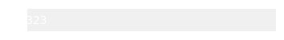
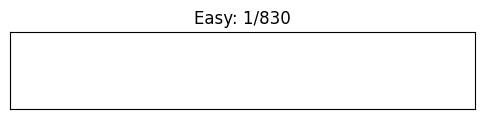
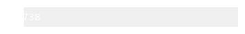
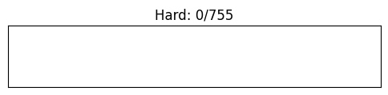

## LeetCode Progress

- **Total Solved**: 
- **Easy**: 
- **Medium**: 
- **Hard**: 

### More Information

You can view more details of my LeetCode solutions on [LeetCode](https://leetcode.com/GiveMeAJob9/).
